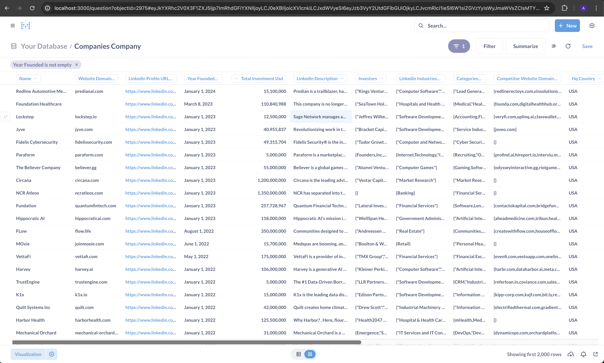

# Open-source Company Database: For Data-driven Deal Sourcing

## Overview
A ready to use open-source company database integrated with BI tool for sales and investment intelligence.



## ⚡ Getting Started
The easiest way to run Open Company Database is inside a Docker container. It works best with the most recent version of Docker, 26.0.0. You must be using Linux, Mac OS, or WSL on Windows.

```shell
docker compose up
```

For the first time, it takes about 2-3 minutes for all 3 containers to come up.

To interact with the sample database, login into Metabase running on [http://localhost:3000/](http://localhost:3000/question#?db=2&table=92) via
- Email: `admin@opencompaniesdb.local`
- Password: `OpenCompanyDatabase@1`

## 📊 Enriching company database via Crustdata API
- Request Crustdata API for free from https://crustdata.com
- Set `CRUSTDATA_API_TOKEN` inside [settings.py](open_companies_database/settings.py)
- By referring to the [API documentation](https://www.notion.so/crustdata/Crustdata-API-Documentation-c66d5236e8ea40df8af114f6d447ab48?pvs=4#3da3f06c9ce241f989829fa80cc1dc7d), update the filter criteria in [crustdata_request_payload.json](crustdata_request_payload.json) for companies to be fetched and enriched. 
- Run `docker-compose --profile enrich up enrich_via_crustdata` . 

## 🛠️ Installation and Development
Open Company Database is a community-driven project, and we welcome contributions from everyone. Whether you're a data engineer who's setting up the company data stack or an AI engineer who wants to leverage company firmographic and growth data to create your agents, there are many ways to get involved:
- Fix bugs
- Code contributions
- Feedback and testing

For details, please check [INSTALLATION.md](INSTALLATION.md).

## License

This project is licensed under the MIT License. See the [LICENSE](LICENSE) file for details.
